- title : Spice up your website with machine learning!
- description : Spice up your website with machine learning.
- author : Evelina Gabasova
- theme : white
- transition : none

*****************************************

# Spice up your website

#  with Machine Learning!

 

Evelina Gabasova 

[@evelgab](http://www.twitter.com/evelgab)  

----------------------------------------

# F# Snippets

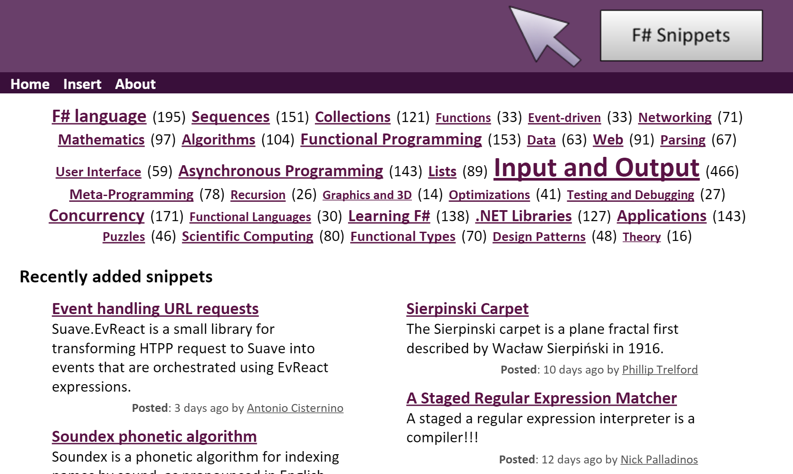

' F# snippets are like Gist on steroids
' Started 5 years ago by Tomas Petricek

----------------------------------------

# F# Snippets

[fssnip.net](http://fssnip.net/1k)

' Demo of F# snippets website
' It all works nice until you start searching for something

----------------------------------------

- data-background : images/fssnip-tags.png

 

' You can search by tag

----------------------------------------

# Searching through F# snippets

over 1600 snippets

over 1100 different tags

----------------------------------------

# Searching through F# snippets

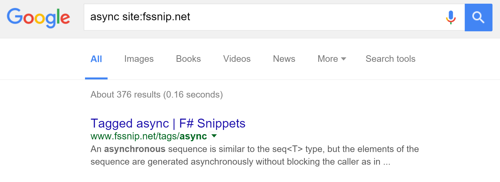

----------------------------------------

- data-background : images/fssnip-tags.png

 

----------------------------------------

# Do we need a custom system?

----------------------------------------

[ 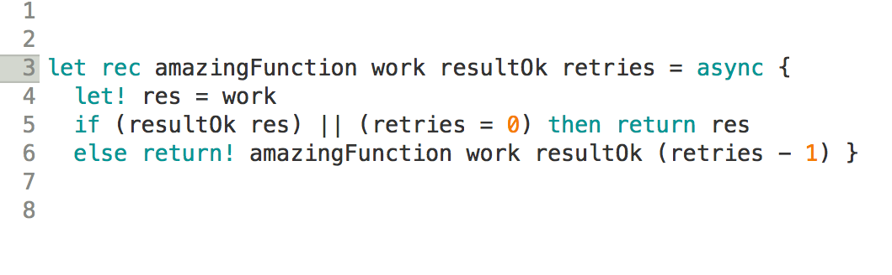](https://www.google.com.br)

' let! tells us that the code uses asynchronous workflows, get return value 
' of an asynchronous function
' Google ignores diacritics, searching for let and let! gives
' the same results although the meaning is very different

----------------------------------------

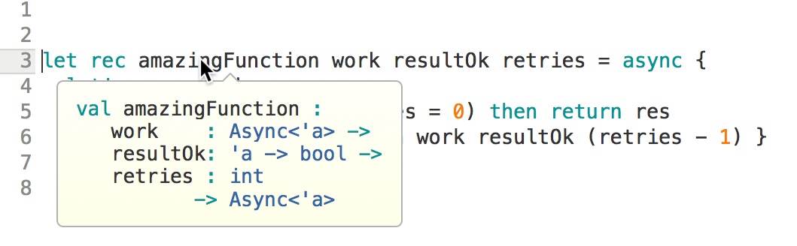

' F# is a statically typed language!
' I'm not interested in how is this function actually called,
' but I'm interested in that it takes asynchronous workflow
' and returns asynchronous workflow.
' This type of information is not available as text and google 
' doesn't index it for search.
' Great opportunity to create a custom machine learning system!!!

----------------------------------------

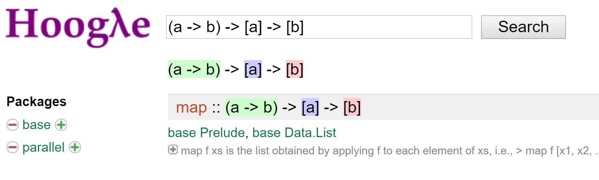

----------------------------------------

## Great opportunity to create a custom machine learning system!

' We're programmers, we like to automate - alternative would be do 
' go through the tags manually and curate them!
' what can possibly go wrong?
' There's this company that also does a lot of machine learning...

----------------------------------------

- data-background : images/alphago-leesedol.jpg

' this year has been great for machine learning
' but as machine learning is getting more and more
' ubiquitous, So are the problems!

----------------------------------------

----------------------------------------

<table><tr><td class="noborder">

</td>
<td class = "noborder fragment">

</td>
</tr></table>

' Sergey Lavrov (Russian foreign minister) = sad little horse

----------------------------------------

----------------------------------------

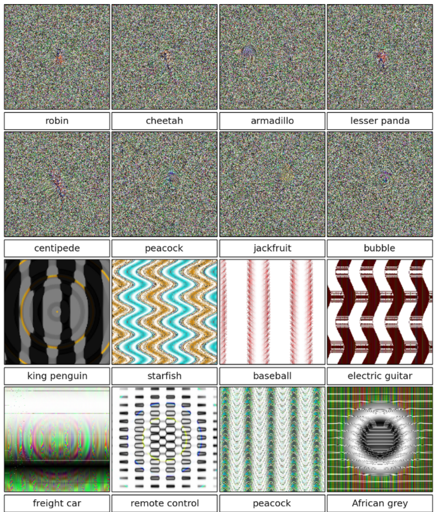

Nguyen A et al.: Deep Neural Networks are Easily Fooled:
High Confidence Predictions for Unrecognizable Images. 2015.

----------------------------------------

- data-background : #550080

# Using machine learning in production

 

- dependence on training data

- inputs

' incoming data is not controlled, users do many different things
' Black boxes can be unpredictable

----------------------------------------

- data-background : #87c594

# User-generated inputs

----------------------------------------

- data-background : #87c594

- data-background : #87c594

----------------------------------------

# PART I
## Finding related snippets

 

If you liked this _F# code_, you'll also like ...

----------------------------------------

# Simple information retrieval

*common terms*

' Looking at common terms is not enough
' Two snippets may have a large overlap if they use common words

----------------------------------------

# Bag of words

 

- ignore order of words

- separate *text* and *code*

' This allows us to look at code and text differently
' Text - free structured
' Code - fixed structure with keywords
' Keywords have different role than variable names

----------------------------------------

# Term frequency

 

<table><tr><td class="noborder">

## Snippet 1

| Term  | Frequency |
|-------|-----------|
| async | 3         |
| x     | 15        |
| The   | 2         |
| code  | 1         |
| ...   |           |

</td><td class="noborder">

## Snippet 2

| Term  | Frequency |
|-------|-----------|
| async | 0         |
| x     | 15        |
| The   | 2         |
| code  | 1         |
| ...   |           |

</td>
</tr>
</table>

' Why comparing snippets based on their term frequency only is not sufficient
' async is informative, x is not
' term frequency is important but cannot be used alone

----------------------------------------

# Inverse document frequency
## Relative importance of terms

 

$$$ 
idf(\text{term}) = \log \frac{\text{number of snippets}}{\text{number of snippets with term}} 

' Weight - how informative a term is
' Look at what features are the least informative

----------------------------------------

# Vector representation: TF-IDF
## Term frequency - inverse document frequency

 

$$$
tfidf(\text{term}, \text{snippet}) = tf(\text{term}, \text{snippet}) \times idf(\text{term})

' This makes it comparable between different documents
' By computing this for every snippet, we get vector representation

----------------------------------------

# Demo

----------------------------------------

# Vector representation of snippets

| Snippet  | x | List | Array | ... |
|-------|-----------|---|---|---|
| snippet1 | 0  |  0.17 | 0 | ...      |
| snippet2   | 0 | 0.04 | 0.001 | ...       |
| snippet3   | 0.23 | 0.005 | 0.31 | ...         |
| snippet4  | 0 |  0 | 0 | ...       |
| ...   |     | | |      |

----------------------------------------

# Vector representation of snippets

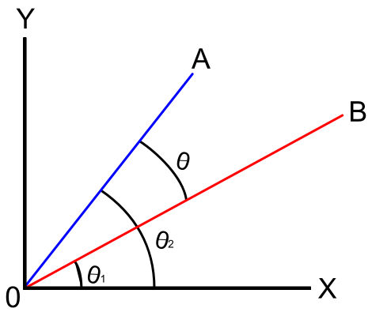

' angle between snippet vectors shows how related they are

----------------------------------------

----------------------------------------

# PART II
## Suggesting tags

 

----------------------------------------

- data-background : images/fssnip-tags.png

 

----------------------------------------

# Suggesting tags

 

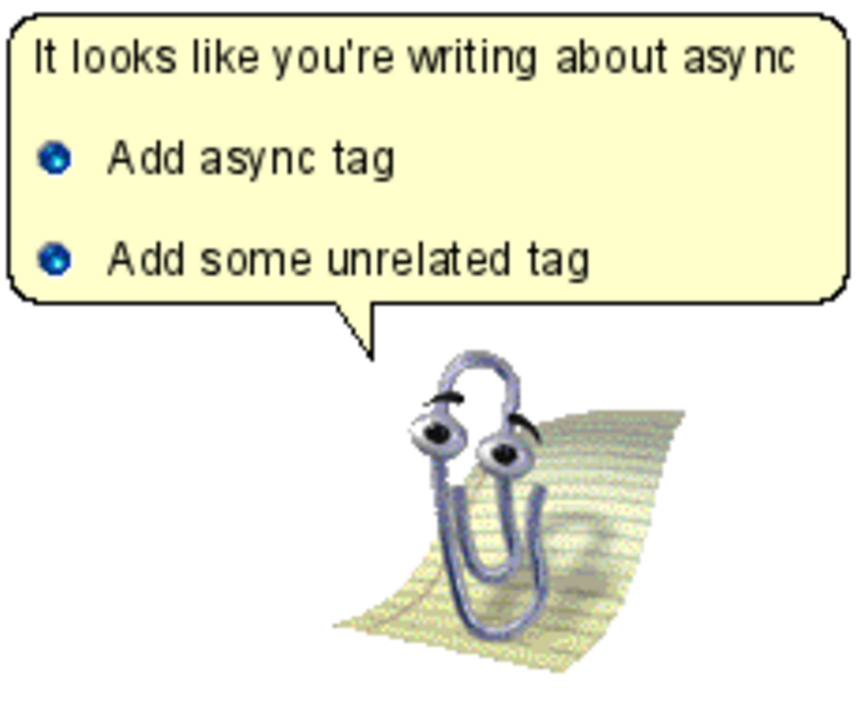

' Actually one of the most popular tags is F#

----------------------------------------

# Making sense of user-generated tags

async, #async, async mailprocessor, async paraller, Async sequences, asyncseq, asynchronous, Asynchronous Processing, Asynchronous Programming, asynchronous sequence, asynchronous workflows 

' Capitalization, plural vs singular, typos, different transcriptions
' singular
' but then Window Form and other things like this

----------------------------------------
# Edit distance

*regex* vs. *regexp*

*sports* vs. *ports*  
*pi* vs. *API*

' insertion, deletion

----------------------------------------
# Machine learning
## From snippets to tags

' Mapping 
' For each snippet, I have a set of tags
' I can use the data to train a predictor

----------------------------------------

# Associations

 

*string* and *parser*

*async* and *MailboxProcessor*

 

*sequence* and *exception*

----------------------------------------
# Naive Bayes

## Why do you call me naive?

----------------------------------------
# Why naive?

 

*string* and *parser*

*async* and *MailboxProcessor*

 

*sequence* and *exception*

' naive means we're making our lives easier because we can
' ignore how individual terms depend on each other

----------------------------------------
# Building a predictor

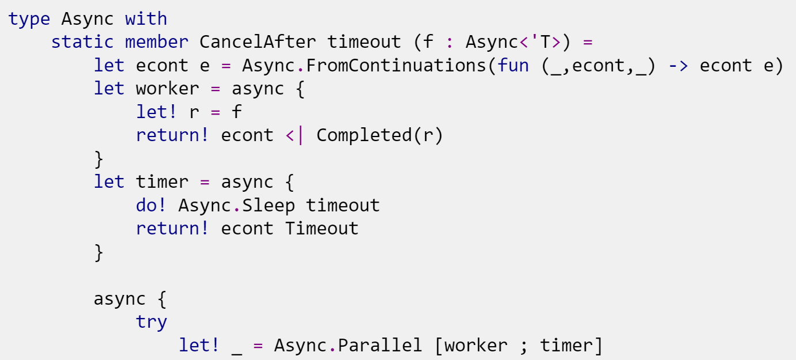

' We can actually estimate this from data

----------------------------------------
# Building a predictor

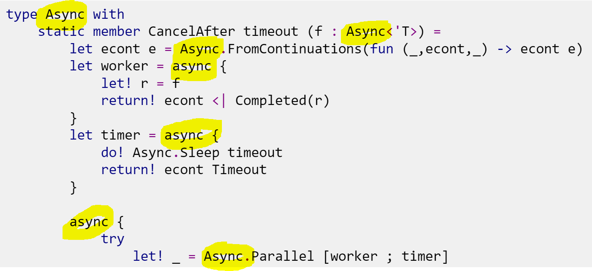

' Maybe this should have the "async" tag!

----------------------------------------
# Building a predictor

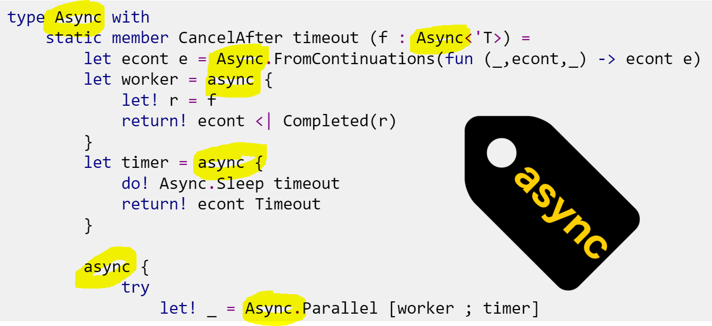

----------------------------------------

# Tag probabilities
## Bayes theorem

 

$$$
p(A \mid B) = \frac{ p(B \mid A) \; p(A)}{p(B)}

----------------------------------------
# Tag probabilities
## Bayes theorem

 

$$$
p(\text{tag} \mid \text{snippet}) \propto p(\text{tag}) \; p(\text{snippet} \mid \text{tag} )

----------------------------------------
# Tag probabilities
## Bayes theorem

 

$$$
p(\text{tag} \mid \text{snippet}) \propto p(\text{tag}) \prod_{\text{term}} p(\text{term} \mid \text{tag})

----------------------------------------
# Tag probabilities
## Bayes theorem

 

$$$
\begin{multline*}
p(\text{tag} \mid \text{snippet}) \propto p(\text{tag}) \times  \\ p(\text{term}_1 \mid \text{tag}) \, p(\text{term}_2 \mid \text{tag}) \, p(\text{term}_2 \mid \text{tag}) \dots
\end{multline*}

----------------------------------------
# 1. Prior probabilities

 

$$$
p(\text{tag}) \approx \frac{\text{Number of snippets with the tag}}{\text{Number of snippets}}

' p(async) = 5%

----------------------------------------

# 2. Tag likelihood

 

How frequent is the *term* among snippets that have the *tag* ?

 

$$$
p(\text{term} \mid \text{tag}) = \frac{\text{Number of snippets with the term and tag}}{\text{Number of snippets with the tag}}

----------------------------------------

# Naive Bayes prediction

 

$$$
p(\text{tag} \mid \text{snippet}) \propto p(\text{tag}) \prod_{\text{term}} p(\text{term} \mid \text{tag})

 

$$$
p(\text{tag} \mid \text{snippet}) \stackrel{?}{>} p(\neg\text{tag} \mid \text{snippet})

' Working in logarithm space
' The whole prediction reduces to summations

----------------------------------------

# The theory is always nicer 

What if there is no snippet tagged *async* that contains *List*?

' Introduce numerical fixes that mean that it is a bit messier
' Naive Bayes is a very simple algorithm - in principle can use any classification algorithm

----------------------------------------

# Demo

----------------------------------------

## Machine learning to improve user experience

----------------------------------------

# Machine learning

1. Why do you need machine learning?

2. Collect your data!

3. Feature engineering.

4. Actual machine learning.

5. Profit!

----------------------------------------

# Machine learning

1. Why do you need machine learning?

2. Collect your data!

3. Feature engineering.

4. Actual machine learning.

5. ...

6. Put it into production.

7. Profit!

----------------------------------------

# Machine learning

1. Why do you need machine learning?

2. Collect your data!

3. Feature engineering.

4. <strike>Actual machine learning.</strike>

5. ...

6. <strike>Put it into production.</strike>

7. Profit!

----------------------------------------

# Machine learning

1. Why do you need machine learning?

2. Collect your data!

3. *Feature engineering.*

4. <strike>Actual machine learning.</strike>

5. ...

6. <strike>Put it into production.</strike>

7. Profit!

----------------------------------------

- data-background : #550080

* Do you really need a custom system?

* Domain representation

* What are important features

* Machine learning is fun!

' Tf-idf as a reasonable representation 
' Choosing which features are important

----------------------------------------

# Learning more 

 - F# snippets [fssnip.net](http://fssnip.net)

 - F# snippets on GitHub [github.com/fssnippets](https://github.com/fssnippets/fssnip-website)

 - The F# Foundation [www.fsharp.org](http://www.fsharp.org)
 - FsLab Package [www.fslab.org](http://www.fslab.org)

 - Introduction to information retrieval [informationretrieval.org](http://informationretrieval.org/) 

----------------------------------------

# Thank you!

<table>
<tr>
  <td class="noborder"></td>
  <td style="vertical-align:middle" class="noborder"> [@evelgab](https://twitter.com/evelgab)</td>
</tr>
<tr>
  <td class="noborder"></td>
  <td class="noborder" style="vertical-align:middle" > [github.com/evelinag](https://github.com/evelinag)</td>
</tr>
<tr>
  <td class="noborder"></td>
  <td class="noborder" style="vertical-align:middle" > [evelinag.com](http://evelinag.com)</td>
</tr>
</table>